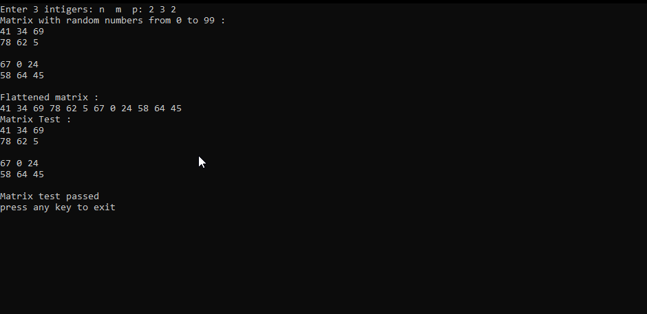
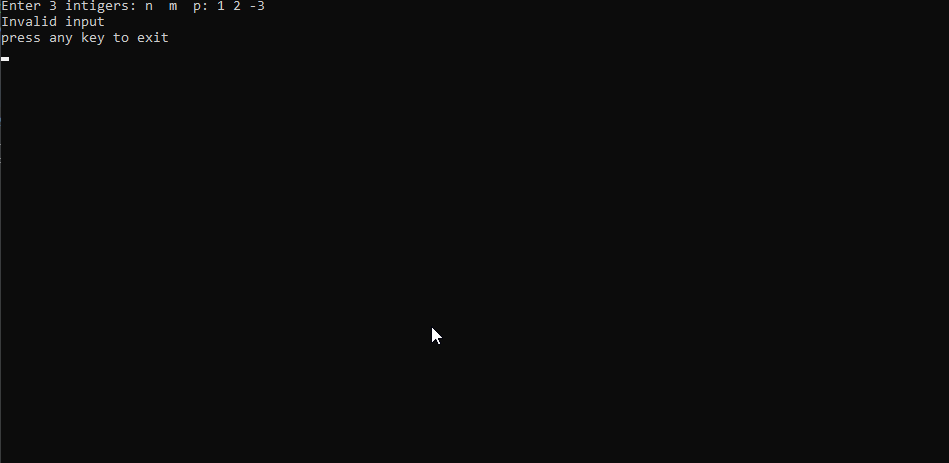

# SEI_T03_Matrix
Matrix Flatten Task, developed in C++, includes an executable with which you can try the code. This was developed as a Task for an internship.

## How To Use
To run the code, an executable is available in MatrixFlatten/flatten.exe, simply run the executable and provide it with the 3D matrix dimensions n,m and p. The code then generates a matrix with those dimensions with random numbers from 0 to 99. The generated random matrix is then flattened to a 1D matrix, Check MatrixFlatten/flatten.cpp for the exact details of how the conversion is done.

Once converted, the flattened matrix is printed to the user. To test if the conversion works, the flattened matrix is used to create a new test matrix using the IndexTo1D function; this function takes in i,j,k,n, and m and returns 1D index y. The new test matrix is compared against the original matrix and if any differences are detected, then the test fails, otherwise the test passes and the code exits. 

## Images
valid input:

Invalid input:

## License

    The MIT License (MIT)

    Copyright (c) 2022 Youssef Zakaria

    Permission is hereby granted, free of charge, to any person obtaining a copy
    of this software and associated documentation files (the "Software"), to deal
    in the Software without restriction, including without limitation the rights
    to use, copy, modify, merge, publish, distribute, sublicense, and/or sell
    copies of the Software, and to permit persons to whom the Software is
    furnished to do so, subject to the following conditions:

    The above copyright notice and this permission notice shall be included in all
    copies or substantial portions of the Software.

    THE SOFTWARE IS PROVIDED "AS IS", WITHOUT WARRANTY OF ANY KIND, EXPRESS OR
    IMPLIED, INCLUDING BUT NOT LIMITED TO THE WARRANTIES OF MERCHANTABILITY,
    FITNESS FOR A PARTICULAR PURPOSE AND NONINFRINGEMENT. IN NO EVENT SHALL THE
    AUTHORS OR COPYRIGHT HOLDERS BE LIABLE FOR ANY CLAIM, DAMAGES OR OTHER
    LIABILITY, WHETHER IN AN ACTION OF CONTRACT, TORT OR OTHERWISE, ARISING FROM,
    OUT OF OR IN CONNECTION WITH THE SOFTWARE OR THE USE OR OTHER DEALINGS IN THE
    SOFTWARE.
